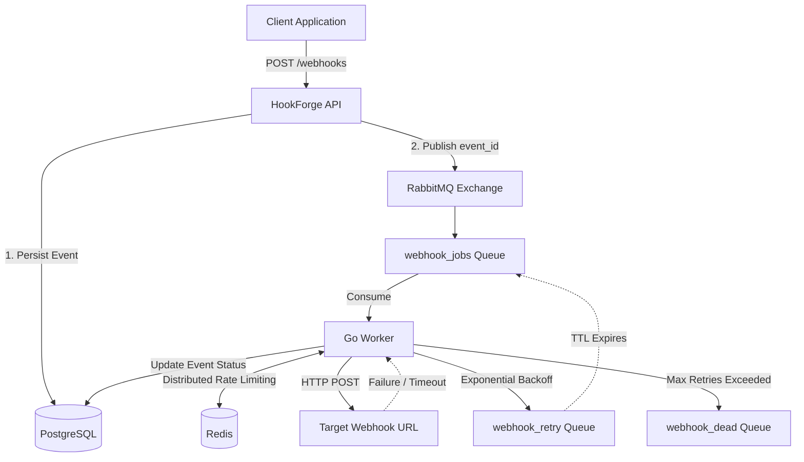

# 🪝 HookForge — Fault-Tolerant Webhook Dispatcher

> A high-throughput, asynchronous webhook delivery system built in **Go**, designed to reliably dispatch HTTP events while handling traffic spikes, rate limits, network failures, retries, and dead-lettered messages.

**HookForge demonstrates production-oriented distributed systems patterns:** asynchronous decoupling, durable messaging, traffic shaping, exponential backoff, retry queues, and dead-letter queues.

---

## 🚀 Why HookForge?

Webhook delivery looks simple until production failures occur.

What happens when:

* A client suddenly sends thousands of events per second?
* The target server goes offline?
* A webhook endpoint starts returning `500` errors?
* The same target is accidentally flooded with requests?
* A message repeatedly fails and should no longer be retried?
* The message broker crashes after the API accepts a request?

HookForge is designed to handle these scenarios using a fault-tolerant, asynchronous architecture.

---

## ⚡ Core Features

### 🔄 Asynchronous Decoupling

The API does not synchronously deliver webhooks. Incoming events are persisted and queued for background processing, allowing the API to respond quickly with:

```http
202 Accepted

```

This decouples **request ingestion** from **webhook delivery**, enabling the system to absorb traffic spikes without blocking clients.

### 🚦 Distributed Rate Limiting

HookForge uses **Redis** to implement distributed traffic shaping. A Fixed-Window rate-limiting algorithm prevents workers from overwhelming target servers.

For example:

```text
Target: example.com
Limit: 2 requests/second

```

This protects external webhook consumers from accidental traffic bursts or distributed worker concurrency.

### 🔁 Exponential Backoff & Retries

Network failures are expected in distributed systems. When a target webhook fails due to HTTP `5xx` responses, network failures, or request timeouts, HookForge retries the event using exponential backoff.

Example retry schedule:

```text
Attempt 1 → 2 seconds
Attempt 2 → 4 seconds
Attempt 3 → 8 seconds

```

Delayed retries are implemented using **RabbitMQ queues, TTLs, and Dead Letter Exchanges (DLX)**.

### ☠️ Dead Letter Queue

Messages that repeatedly fail should not remain in the system indefinitely. After **5 consecutive failures**, HookForge routes the event to a **Dead Letter Queue (DLQ)**.

```text
webhook_jobs
      │
      │ Retry
      ▼
webhook_retry
      │
      │ Max retries exceeded
      ▼
webhook_dead

```

This safely quarantines poison messages for manual inspection or future recovery.

### 💾 Durable Event Storage

Webhook events are persisted to **PostgreSQL before being queued**. The API publishes only the event identifier to RabbitMQ.

```text
PostgreSQL → Source of Truth
RabbitMQ   → Asynchronous Processing

```

This provides two important benefits:

* Large webhook payloads do not unnecessarily occupy broker memory.
* The database remains the authoritative source of event state.

---

## 🏗 Architecture



---

## 🧠 Key Design Decisions

### RabbitMQ vs. Kafka

**RabbitMQ was chosen because HookForge requires task-queue semantics.** Webhook delivery needs individual message acknowledgments, retry queues, delayed message routing, and Dead Letter Queues. RabbitMQ provides these features naturally. Kafka is excellent for high-throughput event streaming and append-only logs, but introduces unnecessary complexity for independent webhook delivery jobs.

### Payload by Reference

RabbitMQ messages contain only the `event_id`. The worker retrieves the complete event from PostgreSQL.
**Why?**

* Keeps broker messages lightweight.
* Avoids duplicating large payloads.
* Maintains PostgreSQL as the single source of truth.

### Goroutines for High Concurrency

Webhook delivery is primarily **network-bound**. Workers spend significant time waiting for remote servers and HTTP responses. Go's lightweight goroutines and **M:N scheduler** allow many concurrent network operations to run efficiently without allocating one operating system thread per request.

---

## 🛠 Tech Stack

| Technology | Purpose |
| --- | --- |
| **Go** | High-performance API and concurrent workers |
| **PostgreSQL** | Durable event storage and delivery state |
| **RabbitMQ** | Asynchronous job queue and retry routing |
| **Redis** | Distributed rate limiting |
| **Docker Compose** | Local infrastructure orchestration |
| **k6** | High-concurrency load testing |

---

# 🛠 Getting Started

## 1️⃣ Start the Infrastructure

Start PostgreSQL, RabbitMQ, and Redis:

```bash
docker-compose up -d

```

## 2️⃣ Start the API Server

From the project root:

```bash
go run cmd/api/main.go

```

## 3️⃣ Start the Background Worker

Open a new terminal and run:

```bash
go run cmd/worker/main.go

```

## 4️⃣ Fire a Test Webhook

Send a test event:

```bash
curl -X POST http://localhost:8080/api/v1/webhooks \
  -H "Content-Type: application/json" \
  -d '{
    "target_url": "https://httpbin.org/post",
    "payload": "{\"hello\": \"world\"}"
  }'

```

---

## 🚀 Performance Benchmarking

Load testing was conducted using **k6** simulating 50 concurrent virtual users bombarding the system for 10 seconds.

* **Ingestion Throughput:** Successfully ingested **~1,500+ requests / second** on a single API node with a 100% success rate (HTTP 202).
* **Delivery Throttling:** The worker node successfully buffered the massive traffic spike in RabbitMQ and smoothed the outbound delivery to exactly 2 req/sec as configured, proving the Redis backpressure mechanism works flawlessly under load.

**To run the benchmark yourself:**
Ensure the API and Worker are running, then execute:

```bash
docker run --rm -i --network host grafana/k6 run - < loadtest/loadtest.js

```

---

## 📁 Project Structure

```text
HookForge/
│
├── cmd/
│   ├── api/
│   │   └── main.go          # API entry point & handlers
│   │
│   └── worker/
│       └── main.go          # Background worker entry point
│
├── loadtest/
│   └── loadtest.js          # k6 benchmarking script
│
├── docker-compose.yml
├── go.mod
└── README.md

```
