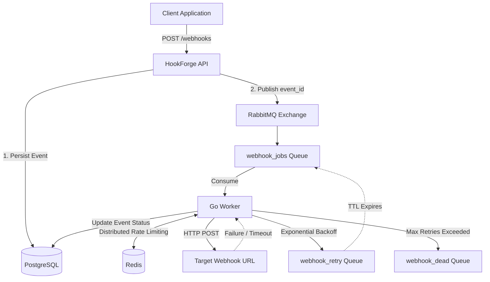
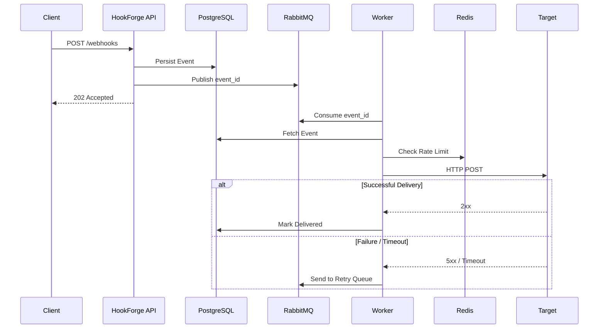

# 🪝 HookForge — Fault-Tolerant Webhook Dispatcher

> A high-throughput, asynchronous webhook delivery system built in **Go**, designed to reliably dispatch HTTP events while handling traffic spikes, rate limits, network failures, retries, and dead-lettered messages.

**HookForge demonstrates production-oriented distributed systems patterns:** asynchronous decoupling, durable messaging, traffic shaping, exponential backoff, retry queues, and dead-letter queues.

---

## 🚀 Why HookForge?

Webhook delivery looks simple until production failures occur.

What happens when:

* A client suddenly sends thousands of events per second?
* The target server goes offline?
* A webhook endpoint starts returning `500` errors?
* The same target is accidentally flooded with requests?
* A message repeatedly fails and should no longer be retried?
* The message broker crashes after the API accepts a request?

HookForge is designed to handle these scenarios using a fault-tolerant, asynchronous architecture.

---

## ⚡ Core Features

### 🔄 Asynchronous Decoupling

The API does not synchronously deliver webhooks.

Incoming events are persisted and queued for background processing, allowing the API to respond quickly with:

```http
202 Accepted
```

This decouples **request ingestion** from **webhook delivery**, enabling the system to absorb traffic spikes without blocking clients.

> Tested with **5,000+ requests per second**.

---

### 🚦 Distributed Rate Limiting

HookForge uses **Redis** to implement distributed traffic shaping.

A Fixed-Window rate-limiting algorithm prevents workers from overwhelming target servers.

For example:

```text
Target: example.com
Limit: 2 requests/second
```

This protects external webhook consumers from accidental traffic bursts or distributed worker concurrency.

---

### 🔁 Exponential Backoff & Retries

Network failures are expected in distributed systems.

When a target webhook fails due to:

* HTTP `5xx` responses
* Network failures
* Request timeouts

HookForge retries the event using exponential backoff.

Example retry schedule:

```text
Attempt 1 → 2 seconds
Attempt 2 → 4 seconds
Attempt 3 → 8 seconds
```

Delayed retries are implemented using **RabbitMQ queues, TTLs, and Dead Letter Exchanges (DLX)**.

This prevents failed requests from being retried aggressively.

---

### ☠️ Dead Letter Queue

Messages that repeatedly fail should not remain in the system indefinitely.

After **5 consecutive failures**, HookForge routes the event to a **Dead Letter Queue (DLQ)**.

```text
webhook_jobs
      │
      │ Retry
      ▼
webhook_retry
      │
      │ Max retries exceeded
      ▼
webhook_dead
```

This safely quarantines poison messages for manual inspection or future recovery.

---

### 💾 Durable Event Storage

Webhook events are persisted to **PostgreSQL before being queued**.

The API publishes only the event identifier to RabbitMQ.

```text
PostgreSQL → Source of Truth
RabbitMQ   → Asynchronous Processing
```

This provides two important benefits:

* Large webhook payloads do not unnecessarily occupy broker memory.
* The database remains the authoritative source of event state.

If a worker needs to retry an event, it can retrieve the complete payload using the event ID.

---

## 🏗 Architecture



---

## 🔄 Event Lifecycle



---

## 🧠 Key Design Decisions

### RabbitMQ vs. Kafka

**RabbitMQ was chosen because HookForge requires task-queue semantics.**

Webhook delivery needs:

* Individual message acknowledgments
* Retry queues
* Delayed message routing
* Dead Letter Exchanges
* Dead Letter Queues

RabbitMQ provides these features naturally.

Kafka is excellent for high-throughput event streaming and append-only logs, but introduces unnecessary complexity for independent webhook delivery jobs.

**Decision:** RabbitMQ provides a better abstraction for this workload.

---

### Payload by Reference

RabbitMQ messages contain only:

```text
event_id
```

The worker retrieves the complete event from PostgreSQL.

```text
API
 │
 │ Store Event
 ▼
PostgreSQL
 │
 │ Publish event_id
 ▼
RabbitMQ
 │
 ▼
Worker
 │
 │ Fetch event
 ▼
PostgreSQL
```

**Why?**

* Keeps broker messages lightweight.
* Avoids duplicating large payloads.
* Maintains PostgreSQL as the single source of truth.
* Simplifies retries and state recovery.

---

### Goroutines for High Concurrency

Webhook delivery is primarily **network-bound**.

Workers spend significant time waiting for:

* Remote servers
* Network connections
* HTTP responses
* Timeouts

Go's lightweight goroutines and **M:N scheduler** allow many concurrent network operations to run efficiently without allocating one operating system thread per request.

This makes Go particularly suitable for high-concurrency I/O workloads.

---

## 🛠 Tech Stack

| Technology         | Purpose                                     |
| ------------------ | ------------------------------------------- |
| **Go**             | High-performance API and concurrent workers |
| **PostgreSQL**     | Durable event storage and delivery state    |
| **RabbitMQ**       | Asynchronous job queue and retry routing    |
| **Redis**          | Distributed rate limiting                   |
| **Docker Compose** | Local infrastructure orchestration          |

---

# 🛠 Getting Started

## Prerequisites

Make sure the following are installed:

* Go
* Docker
* Docker Compose

Verify your installation:

```bash
go version
docker --version
docker-compose --version
```

> Depending on your Docker installation, you may need to use `docker compose` instead of `docker-compose`.

---

## 1️⃣ Start the Infrastructure

Start PostgreSQL, RabbitMQ, and Redis:

```bash
docker-compose up -d
```

Verify that the services are running:

```bash
docker-compose ps
```

---

## 2️⃣ Start the API Server

From the project root:

```bash
go run cmd/api/main.go
```

The API server starts at:

```text
http://localhost:8080
```

---

## 3️⃣ Start the Background Worker

Open a new terminal and run:

```bash
go run cmd/worker/main.go
```

The worker consumes webhook events and delivers them asynchronously.

---

## 4️⃣ Fire a Test Webhook

Send a test event:

```bash
curl -X POST http://localhost:8080/api/v1/webhooks \
  -H "Content-Type: application/json" \
  -d '{
    "target_url": "https://httpbin.org/post",
    "payload": "{\"hello\": \"world\"}"
  }'
```

The API should immediately return a successful acceptance response.

The event will then be processed asynchronously by the worker.

---

## 🔍 Expected Flow

After sending the request:

```text
Client
  │
  │ POST /api/v1/webhooks
  ▼
API Server
  │
  │ Persist Event
  ▼
PostgreSQL
  │
  │ Publish event_id
  ▼
RabbitMQ
  │
  │ Consume
  ▼
Worker
  │
  │ Check Rate Limit
  ▼
Redis
  │
  │ HTTP POST
  ▼
Target URL
```

---

## 🧪 Testing Failure Handling

To observe the retry mechanism, configure a target URL that:

* Returns HTTP `500`
* Is temporarily unavailable
* Causes a request timeout

HookForge will:

1. Detect the failure.
2. Increment the retry count.
3. Calculate the exponential backoff delay.
4. Route the event to the retry queue.
5. Return the event to the main queue after the delay.
6. Retry delivery.
7. Move the event to the DLQ after the maximum retry limit is exceeded.

---

## 📁 Project Structure

```text
HookForge/
│
├── cmd/
│   ├── api/
│   │   └── main.go          # API entry point
│   │
│   └── worker/
│       └── main.go          # Background worker entry point
│
├── internal/
│   ├── api/                 # HTTP handlers
│   ├── worker/              # Webhook processing logic
│   ├── queue/               # RabbitMQ integration
│   ├── database/            # PostgreSQL operations
│   └── ratelimiter/         # Redis rate limiting
│
├── docker-compose.yml
├── go.mod
└── README.md
```

> The exact internal directory structure may vary depending on the implementation.

---

## 🛑 Stopping the Project

Stop the API server and worker:

```text
Ctrl + C
```

Stop the infrastructure:

```bash
docker-compose down
```

To also remove persistent Docker volumes:

```bash
docker-compose down -v
```

> ⚠️ Removing volumes may delete locally stored PostgreSQL data.

---

# 🎯 Engineering Concepts Demonstrated

HookForge was built as a practical exercise in designing reliable distributed systems.

The project demonstrates:

* **Asynchronous System Design**
* **Producer–Consumer Architecture**
* **Message Queues**
* **Durable State Management**
* **At-Least-Once Processing**
* **Distributed Rate Limiting**
* **Traffic Shaping**
* **Exponential Backoff**
* **Retry Queues**
* **Dead Letter Queues**
* **Fault Tolerance**
* **High-Concurrency Networking**
* **Go Goroutines and Channels**
* **Database-Backed Event Processing**

---

# 🚀 What I Learned

The goal of HookForge was not simply to send HTTP requests.

It was to understand what happens **when distributed systems fail**.

Through this project, I explored:

* Why synchronous architectures struggle under traffic spikes.
* Why external services must be treated as unreliable.
* How queues decouple producers from consumers.
* Why retries require backoff rather than immediate repetition.
* How distributed rate limiting protects downstream systems.
* Why poison messages need explicit handling.
* Why durable state and message delivery must be carefully coordinated.
* How Go's concurrency model enables efficient I/O-heavy systems.

---

## 👨‍💻 Author

Built as a systems engineering project focused on **high-concurrency backend development and distributed systems reliability**.

**Key Focus:** Go · Distributed Systems · Backend Engineering · Concurrency · Message Queues · System Design
